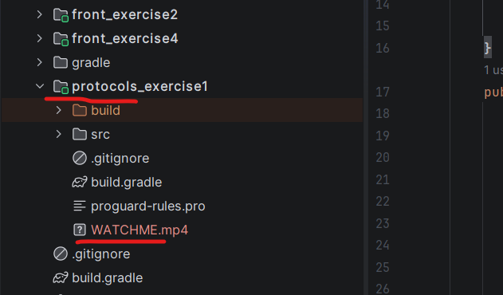
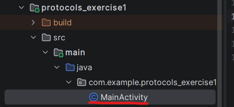
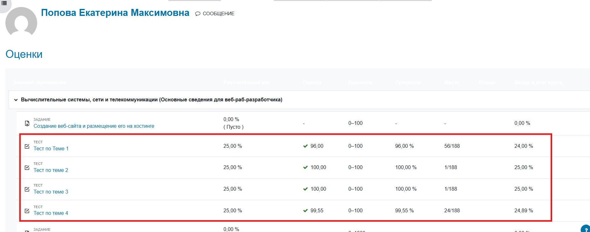

**Участники команды и их роли:**

фронт - Горбунов Артем Андреевич, мен-339202, bivaetctoskazat123@gmail.com

протоколы - Попова Екатерина Максимовна, мен-339201, ya_ne_petrovich@mail.ru

источники данных - Тамбовцева Анна Владимировна, мен-339203, anntambovtseva@mail.ru
___
**Пользовательская документация** 

Каждый модуль представляет из себя соответствующее задание: <роль>_exercise<номер>

На уровне каждого модуля расположены файлы WATCHME.mp4 - видео-файлы, демонстрирующие работу кода

Чтобы запустить код, соответсвующего задания, необходимо найти и запустить файл MainActivity

___
**Протоколы, задания 2-4 (тесты на elearn)**

Результаты:

___
**Источники данных, задание 3**

Задание распологается в отдельном репозитории https://github.com/anyatambovtseva/mobile_development_2026